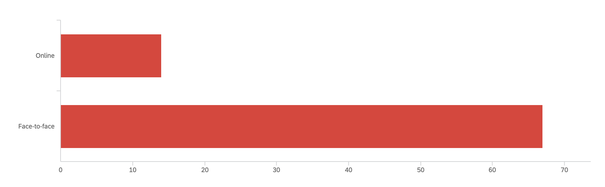
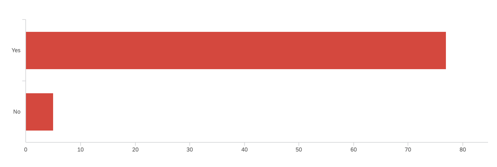
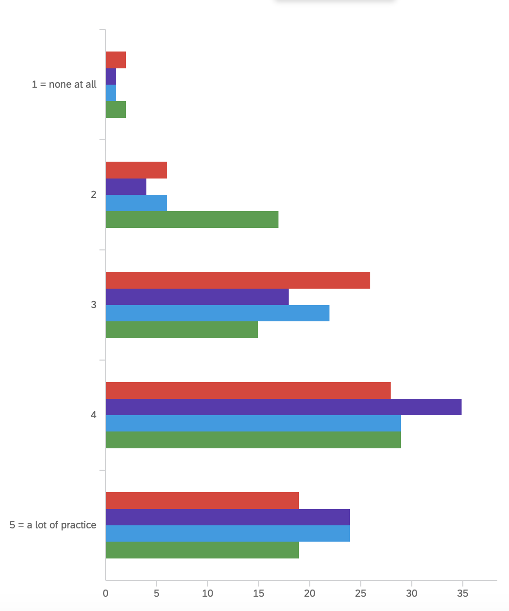

# Number and profile of participants

A total number of 87 people responded, I took out the data from 6 surveys because they didn't respond to every question and/or just clicked through to try to gain extra credit. The students all fall in the traditional student age range of 18-25, except for 1 that falls in the 25-35 age range. 

Here is a breakdown of the courses that the students are currently taking:

| Course number | Number of students |
|:--------------|:-------------------|
| 940:101:01    | 1                  |
| 940:101:94    | 3                  |
| 940:102:90    | 1                  |
| 940:121:01    | 13                 |
| 940:121:02    | 1                  |
| 940:131:01    | 12                 |
| 940:131:02    | 1                  |
| 940:131:03    | 14                 |
| 940:131:90    | 2                  |
| 940:132:01    | 9                  |
| 940:132:90    | 13                 |
| 940:132:91    | 4                  |
| 940:261:01    | 7                  |

The divide between online vs in person students who completed the survey is 23 online, 51 online, and 7 hybrid. There are 35 Freshmen, 27 Sophomores, 11 Juniors, and 9 seniors. Before COVID, only 9 students had taken online courses, whereas 73 had not. 

The students speak other languages at home, we have Mandarin, Hindi (6), Gujarati (5), Kannada, Korean (2), Malayalam (2), Haitian Creole, Telugu (3), Arabic, Tamil (5), Urdu (3), Bengali (2), Romanian, Armenian, Turkish, Portuguese, and Japanese speakers taking Spanish courses. 

We have a mix of commuters and students who live on-campus (1-5 miles away) or close to campus (5-15 miles away) and students who live quite far (15-20+ miles away):

| Distance         | Number of students |
|:-----------------|:-------------------|
| 1-5 miles away   | 32                 |
| 5-10 miles away  | 5                  |
| 10-15 miles away | 12                 |
| 16-20 miles away | 6                  |
| 20+ miles away   | 27                 |

This is something we should take into consideration as it will likely play a role in if they are choosing online or in person classes. 

We also have students who are working (31 total vs 51 who are not currently working). Of those 31 students who are working, 5 work between 0-5 hours a week, 10 work between 5-10 hours a week, 10 work between 10-15 hours a week, 3 work between 15-20 hours, and 3 work 20+ hours a week. This is another thing we should take into consideration, especially when it comes to providing sections of online classes. 

# Motivation for taking a language course

The students were asked to describe their motivation for taking language courses in an open-ended response question. I made a word cloud that visualizes common themes in their answers. 

Unfortunately, the vast majority of people are taking Spanish courses to fill a requirement for the Honors College, SAS, or their major or minors. I'm not sure if this is good or bad news... as it seems like the Honors College students are very vocal about only being there because they need to fill a requirement (32 students). There are quite a few people here learning Spanish because their partner's families speak Spanish. More than 8 students mentioned it would be beneficial for their future careers (either in Health Care or Law). We should consider offering or developing more Spanish for the professions courses for these students. Then we have the students that we love to see in the department that mention fostering deeper connections and being able to communicate with others in a common language. 

# Motivation for choosing in person or online 

The people who responded with why they chose an in person class all had similar answers. Here are the ones that stick out the most. 

- "I feel like with learning a language, the in person communication is super important. One of the best ways of learning a language is by surrounding yourself by people that can also speak the language well. Online would have taken some of this away from the opportunity." 

- "I knew that face-to-face interaction would force me to pay attention and not get distracted." 

- "So I can build a professional relationship with my professor and get more help" 

- "In person is much easier to learn a language because you can have more fluid and consistent conversations." 

- "I felt that an in person class would be better for me in terms of my learning and comprehension of the language. I also believe that an online class would make me lazy and I wouldn't do as much as work as if I did in person class."

- "I think with an in-person class I can learn a lot more. Having a face-to-face conversation with my professor in Spanish is more valuable than one with my computer screen. I can say this with experience because I took an online class during the Spring semester of 2022."

The majority of the students who answered this question focused on the benefits of face-to-face interactions with peers and the instructor. But, there responses along the lines of "this was the only section open" or "I didn't know online classes were available". 

For the students who chose online instead, here are some of the answers that stick out: 

- "I choose an online class over an in person class because it offers me more flexibility on when to complete the tasks assigned." 

- "In-person classes don't work for my schedule." 

- "I chose an online class because the time for the in person class could not work into my schedule. However, an online class allows me to work and study on my own pace while abiding by the deadlines."

There were unfortunately answers like the following: 

- "I didn't choose because it was an online, but I realized it was the only available language course that would work with my schedule."

- "I have never liked taking spanish, so taking it online allowed me to avoid the pain of taking it in person." 

I think in general, our students who are commuters or who work full-time hours are taking advantage of the online classes because they fit better with their work schedule. This is further confirmed when they answered the question "Do online classes facilitate having a job with attending Rutgers?" and 57.32%	(47 students) said yes. But overall, I believe students prefer in person language classes. To see how effective they find online classes we asked: "On a scale of 1 to 5, how effective do you believe online language education is (in comparison to face-to-face or hybrid)? 1 = not effective at all and 5 = very effective" Here is a breakdown of their responses: 

| Scale response           | Number of responses |
|:-------------------------|:--------------------|
| 1 = not effective at all | 7                   |
| 2                        | 16                  |
| 3                        | 33                  |
| 4                        | 22                  |
| 5 = very effective       | 3                   |

In general, it appears that they don't have a preference towards one format or the other, with the majority of the responses falling in the 3 range. But it should be noted that staying motivated in a class is more likely to happen in a face-to-face class vs an online one. This can be seen below as the majority (67 responses) favored face-to-face classes for staying motivated than online ones: 

# How we're doing 

Overall, I think we're doing well. When asked if they thought that they have progressed in their language abilities thus far (at the midpoint in the semester), the vast majority said yes (77 students). 

The students that responded with "No" to that question listed the follow reasons as to why they have not made any progress: 

- "Because I took online classes"

- "I keep getting discouraged when I do not get something everyone seems to know"

- "Instruction isn't very in depth, class feels rushed" (this student comes from 940:121:01)

- "It's my fault, I have not allotted the proper amount of time to it"

There are three things we could take from this to work on for the future. The first, we should take a look at our asynchronous online classes and see what improvements can be made to them. Maybe reformatting the assignments or the way that they are set up would be beneficial. 

The second, we should offer for next semester a "best practices" PD for the TAs next semester, so we can get at "in depth instruction in the language classroom". Or something focused on comprehension checking so that the students who are feeling lost or that instruction isn't very in depth will have their needs met.

The third, is not necessarily something we can do, but something that we should add to the syllabus that mentions putting in the time and work, as learning a language is difficult and a journey that doesn't necessarily have a destination. Students should be made aware that learning a language (especially Spanish) will not be an easy A and it is a course just like in another other discipline that requires work, attention, and effort.  

The students were asked how much practice they have had in the target language in speaking, reading, writing, and listening on a scale of 1 to 5 where 1 is no practice at all and 5 is a lot of practice. Here is a visualization of their answers:

The colors refer to the following skills: red is speaking practice, purple is reading practice, blue is writing practice, and green is listening practice. Overall, it appears that students are getting sufficient practice in each area of language learning/use, but let's take a deeper look at their responses. 

The students were asked the follow-up question of "why they felt they haven't had enough practice in speaking, reading, writing, or listening?" and here are the responses that stick out: 

- We do not receive as many listening assignments compared to others (Student from 940:132:91)

- Since the course is online, I don't have enough opportunities to have real conversations with others.

- It was not covered as much or practiced as much in writing specifically. 

- Recording is different than actually communicating with other people. (Student from 940:132:91)

- The work is not appealing (Student from 940:131:01)

- I feel like for listening, it takes me a lot of time to break down the sentences to a level where I can understand. It is difficult for me to practice because I'm not exposed to Spanish on a daily level, and even when I listen to Spanish music, the speaking speed is too fast for me. Speaking and writing is easier for me because I can see it right in front of me. Reading is somewhere in the middle, where I can understand the general subject or question of the sentence, but I may not know all the meaning of the words.

- It is really just comes down to time management. On top of other classes I have work and other obligations. I try to practice as much as I can but I cannot always get the amount of practice I would like

- We don't read, speak, or write in spanish very often in class (Student from 940:121:01)

- We don't do many activities for writing or speaking (Student from 940:121:01)

- I feel like I need more practice in speaking because it's the hardest part of learning a language for me. Not only do you have to use the correct grammar and pronunciation but you also have to think on the spot which stresses me out and makes me forget what I wanted to say (Student from 940:131:01)

- I don't think there's been enough speaking practice (Student from 940:132:90)

I think there is a lot to unpack here that could be a good starting point to a discussion on what/where improvements can be made so that students in all classes, no matter the format, are getting adequate practice in all areas. The biggest thing right now that I'm seeing, and something we should try to find a solution for, is having assignments, practice, or a system/resource in place for online students to get the speaking practice and interactions with other speakers that they are craving. For the other comments, I think we could come up with solutions, ideas, and other improvements for the language program for either next semester or the following year. Overall, students are progressing in their language abilities, but there is always room for improvement :)
